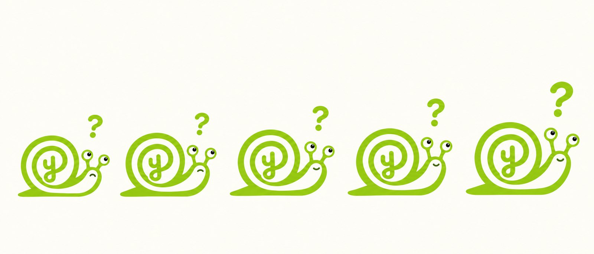

<div align="center">

<picture>
  <source media="(prefers-color-scheme: dark)" srcset="assets/banner-dark.jpg">
  <source media="(prefers-color-scheme: light)" srcset="assets/banner-light.jpg">
  
</picture>

*The AI that asks before it answers.*

[**ytho.co**](https://ytho.co) · Knoxville, Tennessee · Patent pending

</div>

---

## What this is

Ask Y anything. Y asks why. Then it asks why again, until it's clear what
you're really after. Then it answers that. Once.

Most of what we ask a machine isn't quite the question we mean, so we ask
again. And again. Every answer costs something: electricity, water, the part
where you think. Y runs the Five Whys instead:

| | |
|:--|:--|
| **1. Ask** | What's the fastest way to learn Spanish? Should we get a dog? How do I sleep better? |
| **2. "Why?"** | Y asks. You answer. Y asks again. Five times, usually. |
| **3. Answer** | "So really, you want to know…" and then one answer, to the question you meant. |

The company is imaginary. The curiosity is not.

## The origin story

Y is the brainchild invention of **Avie Abell** of Knoxville, Tennessee.

It began the way most good ideas do: a kid asking *why* over and over until the
nearest adult ran out of answers. Somewhere in there came the realization that
the questions were more fun than the answers.

So Avie drew a snail. The snail's shell spiralled into a lowercase `y`. It got
a question mark over its head and a tagline underneath. This repository is
everything that happened after that.

## Running it

```bash
git clone https://github.com/alex-abell/y.git
cd y
open index.html
```

That's it. There is no build step, no toolchain, no dependencies, no lockfile,
no framework, and nothing to install. The entire site is one 24 KB HTML file
with its CSS and JavaScript inline. No web fonts either: it uses the system
stack, so it looks like the platform it's on.

This is not laziness. A page about a snail should not need a bundler.

## What's in here

| Path | What |
|:--|:--|
| `index.html` | The whole site. Markup, styles, the scroll reveals, the hero loop, the Ask Y demo and the snail that crawls along the bottom as you read. All inline. |
| `assets/hero.jpg` | The hero poster and the first thing to paint. Also cropped to `og.jpg` for link previews. |
| `assets/hero-loop.mp4` | Ten seconds of Y on black, H.264, no audio track. `hero-loop.webm` is the same clip in VP9 for browsers without H.264. |
| `assets/desk.jpg` `fridge-drawing.jpg` `shell.jpg` `sketchbook.jpg` | The four section images. The fridge one is the real drawing. |
| `assets/crawler.png` | The scroll-progress snail, with alpha, at 3x its 56 px display height. |
| `assets/y-glyph-white.png` | The one-colour mark used in the nav and the demo tile. |
| `assets/y-app-icon.png` | Favicon. |
| `assets/y-mark.png` `y-*.jpg` | The first site's illustrations. No longer on the page, kept so old links and the old link preview keep resolving. |
| `assets/banner-*.jpg` `snail-progress.jpg` | This README's artwork. |
| `vercel.json` | Static hosting. Declares that there is nothing to compile. |

About 1.5 MB on a first visit, half of it the hero clip. Zero build output.

## Brand

The logo is exactly three colours. Not approximately three. Exactly.

| Swatch | Hex | Role | Pixels |
|:--|:--|:--|--:|
| 🟩 | `#A8E123` | Light lime | 30,017 |
| 🟢 | `#91CE09` | Mid lime | 32,420 |
| ⬛ | `#192120` | Pupils, and only the pupils | 708 |

The page palette extends that:

```
#A3E01F    the brand lime: buttons, eyebrows, Y's side of the conversation
#C9F25A    the bright stop in the headline gradient, which drifts on a 7 s loop
#B4EA3A    button hover
#000000    the page ground
#F5F5F7    headlines and body copy
#A1A1A6    supporting copy
#86868B    captions, spec labels, the footer
#1D1D1F    the Ask Y demo tile
#161C1F    ink, for text on lime
```

Values: **Curiosity / Clarity / Progress / A brighter tomorrow.**

## Four things this repo learned the hard way

Every one of these shipped broken first, or would have. They are written down
so they don't happen twice.

### 1. A trailing slash took down every image on the page

The page originally referenced its assets relatively, as `assets/y-mark.png`.
Vercel served it at both `/y` and `/y/` with no redirect between them. Relative
URLs resolve against the *directory* of the current URL, so:

| Page URL | `assets/y-mark.png` resolves to | Result |
|:--|:--|:--|
| `/y/` | `/y/assets/y-mark.png` | 200 |
| `/y` | `/assets/y-mark.png` | **404** |

One missing character and all eleven images plus the favicon failed together.
It looked like a flaky CDN or a corrupt file. It was neither.

**Now:** every asset path is absolute. The page does not care how you arrive.

### 2. The snail weighed 199 KB and should have weighed 14 KB

The logo was cropped from a brand sheet whose lime green carried JPEG grain. So
a flat two-colour drawing was storing **13,774 distinct colours** at 1.13 bytes
per pixel, and it was the most-requested asset on the page.

Snapping every pixel to the three colours the mark actually uses took it from
**199 KB to 14 KB**, a 13x reduction, with no visible difference at any size on
either background.

> **The trap:** the first attempt used automatic median-cut quantisation. Median
> cut allocates palette slots by volume, and the pupils are only 686 pixels out
> of 180,180. It deleted every one of them and turned the googly eyes solid
> green. Always check that the small important thing survived the optimisation
> that was measured on the big unimportant thing.

### 3. Rewrites lose to the filesystem

While the page lived in a subdirectory of a larger site, `ytho.co` needed its
root mapped to `/y/`. A host-scoped `rewrite` in `vercel.json` was the obvious
tool. It deployed cleanly and never fired once.

**Vercel applies `rewrites` only *after* checking the filesystem.** A request
for `/` matched the site's existing root `index.html`, so the static file won
every time and the rewrite was skipped silently. No error, no warning, no log.

`routes` are evaluated *before* the filesystem and worked immediately. They
cannot be combined with `trailingSlash`, `cleanUrls`, `redirects` or `headers`,
which is the cost.

**Now:** none of this applies. In its own repository the page *is* the root, so
`index.html` is served at `/` by default and the routing rules are gone.
Splitting the repo deleted the problem instead of configuring around it.

### 4. The hero clip downloaded twice

The hero is a ten-second clip that has to loop without a visible cut. The
trick is two stacked `<video>` elements pointing at the same file: play one,
and 0.9 s before it ends, start the other and crossfade. Simple, and it works.

It also fetched the 790 KB file **twice**. Two elements, two in-flight
requests, and the browser's media cache did not merge them. The page weighed
half as much as the network said it did.

**Now:** the script fetches the clip once, wraps it in a blob URL, and hands
that one URL to both elements. One request, and both copies seek instantly
because the bytes are already local. While it's on the way, the poster is
showing, so nothing waits on it.

Two related things that were nearly wrong:

- The clip shipped with a 128 kb/s AAC track. The video is muted, so that was
  160 KB of silence. It's gone.
- H.264 in an MP4 plays everywhere people actually browse, but not in the
  open-source Chromium builds test tools ship, so the loop code had never
  really been exercised. There is now a VP9 WebM next to the MP4, chosen with
  `canPlayType`, which is also what the tests play.

Anyone with reduced motion turned on, or data saver, gets the poster and no
clip at all.

## Deployment

Pushes to `main` deploy to [ytho.co](https://ytho.co) via Vercel. No build
command, no install step, `outputDirectory` is the repo root. Every branch and
pull request gets a preview deployment first.

To change something: edit `index.html`, push, done.

## Roadmap

| Quarter | Goal | Status |
|:--|:--|:--|
| Q1 | Ask why | Complete |
| Q2 | Still asking | Ongoing, strong momentum |
| Q3 | Getting somewhere | We can feel it |
| Q4 | A brighter tomorrow | Right on schedule |

## FAQ

**Is Y real?**
The idea is real and so is the kid who had it. The company is imaginary. The
snail is emotionally real to everyone involved.

**Why a snail?**
Snails carry their home with them, never rush, and always leave a trail showing
where they've been. Also the shell already looked like a question mark.

**How fast is Y?**
Yes.

**Can I add salt?**
No.

**What happens if I answer Y's question?**
Y asks why. Then you answer that. Then Y asks why. Somewhere in there you
figure something out. That part isn't a joke. That part is the whole idea.

## Credits

Invented, named, drawn and tagged by **Avie Abell**, Knoxville, Tennessee.

Built out by her dad, who mostly just kept asking why until it worked.

<div align="center">



**Curiosity moves you forward.**

*Slowly.*

</div>
